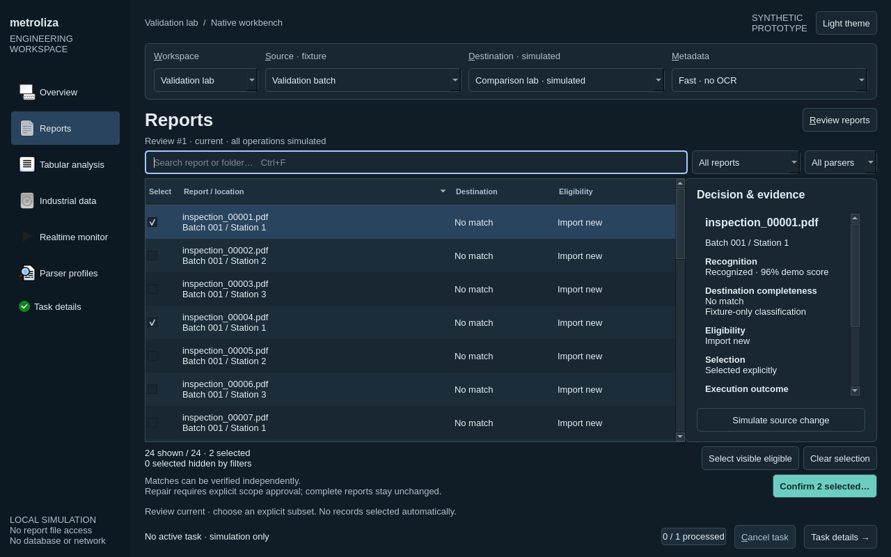

# Native workbench prototype · #1023

Synthetic only. No production import, report scanning, database connection, network,
OCR or credentials. State persists across navigation in this process; closing resets it.

From this directory, using an existing environment with PyQt6:

```sh
python app.py
```

Development environment verified on this host:

```sh
/tmp/metroliza-1019.6sg67g/venv/bin/python app.py
```

Use Review reports, select rows with checkboxes or Space, then Confirm selected.
Filtering preserves selected identities, including hidden selections. Scope confirmation
lists the exact reports and separately asks for repair permission. Destination matches
can be verified without any new report. Accepted complete graphs are preserved.

Ctrl+1 Overview; Ctrl+2 Reports; Ctrl+F search; Ctrl+J task details. Tab and Shift+Tab
navigate native controls. Task cancellation is always available in the bottom bar.
Choose a fixture source in the persistent context to exercise five eligible records,
destination-only matches, empty/missing source or 10,000 rows.

Pinned design baseline: `develop@dd0f964cbcf8cd3382fd68dd528b22c1a3b5d7be`.
All operations are in-memory simulations, not production readiness evidence.
Production CI: **NOT RUN**. No Actions dispatch is part of this experiment.

Prototype tests:

```sh
python -m unittest -v test_workbench
```

See [native screenshots and measured validation](VALIDATION.md) and the
[capability matrix, integration plan and rollback](CAPABILITIES.md).

The Validation batch includes a deterministic execution-time source change at report
12 and a simulated failure at report 13. They demonstrate separate rejection/failure
evidence; Five eligible reports provides the all-success subset path.


